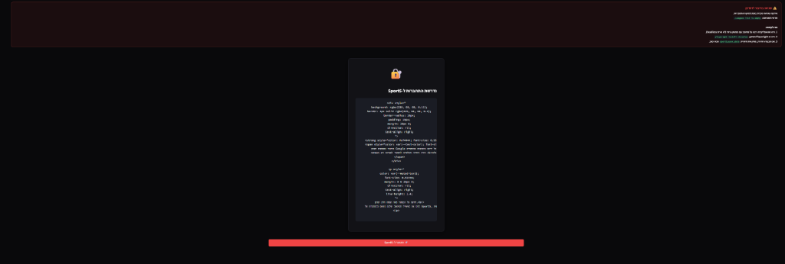
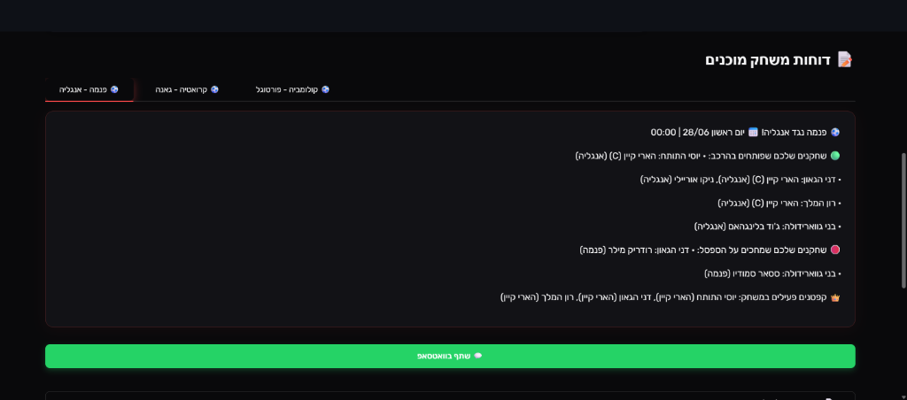

<div align="center">

# 🏆 Sport5 Fantasy Analytics Dashboard

**מערכת ניתוח מתקדמת לליגת החלומות של ספורט 5 — מונדיאל 2026**

[](https://python.org)
[](https://streamlit.io)
[](https://playwright.dev)
[](https://pytest.org)
[](https://github.com/yaronbs12/sport5-fantasy-bot)

</div>

---

An advanced automation engine and analytics dashboard for the **Sport5 Dream Team** Fantasy Football League.
Built to pull, compile, normalize, and report on competitor rosters across an entire FIFA World Cup 2026 season.

---

## ✨ Features

| Feature | Description |
|---|---|
| 🤖 **Automated Browser Pipeline** | Orchestrates Chromium via Playwright for secure, stateful session management |
| 🗺️ **Data Normalization Engine** | Resolves bilingual Hebrew/English player names and country mappings |
| 📊 **League Analytics** | Top 5 player ownership rates, squad comparisons, captain tracking |
| 💬 **One-Click WhatsApp Share** | URL-encoded match reports ready to share in your league group |
| 🌗 **Dark / Light Mode** | Responsive RTL (Right-to-Left) Hebrew UI with custom Rubik font |
| 🔐 **Secure Session Management** | Playwright-persisted cookies, isolated from Git via `.gitignore` |
| 🧪 **TDD Test Suite** | `pytest` unit tests ensuring 100% data-join normalization integrity |

---

## 🛠️ Core Architecture & Engineering Highlights

* **Automated Browser Pipeline:** Orchestrates Chromium browser contexts using Playwright for secure, off-screen local session management and stateful authentication, querying Sport5 API endpoints.
* **Data Normalization Engine:** Employs a robust translation mapping dictionary resolving bilingual differences (e.g. matching tournament names like `"Haiti"`, `"Ecuador"`, and `"Cape Verde"` to Hebrew entries `"האיטי"`, `"אקוודור"`, and `"קייפ ורדה"`) and sanitizing player names containing layout symbols or backticks.
* **League Analytics:** Parses and aggregates complete competitor rosters across the entire processed league to calculate dynamic player ownership rates, squad compositions, and a Top 5 player popularity leaderboard.
* **Premium UX:** Integrates a responsive dark/light mode toggle, custom fonts, a CSS-animated bouncing football loading state (`⚽`), and a one-click WhatsApp report share using URL-encoded text payloads.
* **Robust Testing Layer:** Implements a test-driven development (TDD) cycle built with `pytest` unit test suites to guarantee 100% data-join normalization integrity.

---

## 📸 Screenshots

### 📊 Analytics Dashboard


### ⚽ Live Match Report & WhatsApp Share


---

## 🚀 Installation & Local Usage

We provide cross-platform automated setup scripts to streamline dependency installation:

### 1. Automatic Setup
* **On Windows:** Double-click or run `setup.bat` in your terminal.
* **On Mac/Linux:** Run `bash setup.sh` in your terminal.

These scripts automatically install Python dependencies, configure Playwright, and verify the test suite.

### 2. Manual Setup (Alternative)
If you prefer setting up manually, run the following commands:
```bash
# Install Python packages
pip install -r requirements.txt

# Install Playwright Chromium binaries
playwright install chromium

# Run automated tests
pytest test_scraper.py
```

### 3. Launch the Dashboard
Start the dashboard application:
```bash
streamlit run app.py
```

---

## 🔐 Authentication & Session Setup

To scrape league rosters, the pipeline must establish a session with your Sport5 account:

1. **Initial Run:** When you launch the dashboard for the first time, the status bar will show `נדרש חיבור` (Connection Required).
2. **Interactive Login:** Click on **🚀 התחבר ל-Sport5** (Login to Account). An interactive Chromium browser window will open.
3. **Authentication:** Log in to your Sport5 account via **Email & Password only** (Google/Facebook login is not supported by the pipeline).
4. **Session Persistence:** Your credentials and cookies are securely cached in a local directory (`sport5_user_data/`). Subsequent executions will authenticate automatically.
5. **Switching Accounts:** To switch accounts or log out, click **🚪 התנתק מהמערכת** (Logout) at the bottom of the dashboard.

---

## 🔒 Security & Environments

This application separates code logic from operational secrets and user session state:
* **Credential Isolation:** API endpoints, Discord or Slack webhooks, and private URLs are isolated via Streamlit's native secret manager (`.streamlit/secrets.toml`).
* **Session Protection:** Saved cookies, authenticated states, and profile files (`sport5_user_data/`) are strictly kept on local storage and excluded from Git version tracking via `.gitignore` to prevent leakage to public source directories.
* **Debug Isolation:** A local `DEBUG` flag is available in `config.py` to prevent structural debug files (`leagues_debug.json`, `sport5_teams_debug.json`) from generating during normal runtime execution.

---

## 🧱 Tech Stack

| Layer | Technology |
|---|---|
| UI Framework | [Streamlit](https://streamlit.io) |
| Browser Automation | [Playwright for Python](https://playwright.dev/python/) |
| Language | Python 3.11+ |
| Testing | pytest |
| HTTP Client | requests |
| Fonts | [Rubik (Google Fonts)](https://fonts.google.com/specimen/Rubik) |

---

<div align="center">

Built with ❤️ by [Yaron](https://github.com/yaronbs12) &nbsp;·&nbsp; ⭐ Star this repo if you found it useful!

</div>
